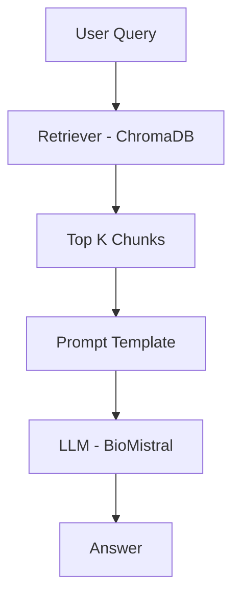

# RAG Chatbot (Medical + GenAI)


A Retrieval-Augmented Generation (RAG) chatbot using LangChain, ChromaDB, and a local LLM (BioMistral) to answer questions from PDF documents.  
This project demonstrates end-to-end document question answering using vector search and LLM-based generation.

---

## Features

- Multi-document support (Medical + GenAI PDFs)
- Semantic search using embeddings
- Vector database (ChromaDB)
- Local LLM inference using LlamaCpp (BioMistral GGUF)
- Hybrid prompt (context + fallback knowledge)
- Interactive chatbot UI using Gradio

---

## Architecture

This pipeline ensures that the LLM generates responses grounded in retrieved document context.

User Query → Retriever → Context → LLM → Answer



---

## Demo


---

## Tech Stack

- LangChain
- Sentence Transformers
- ChromaDB
- LlamaCpp (GGUF model)
- Gradio

---

## How It Works

1. Load PDF documents  
2. Split into chunks  
3. Generate embeddings  
4. Store in vector database  
5. Retrieve relevant chunks  
6. Pass context + query to LLM  
7. Generate concise, context-aware answer

---

## Setup

```bash
pip install -r requirements.txt
```

---

## Run

```bash
python app.py
```
