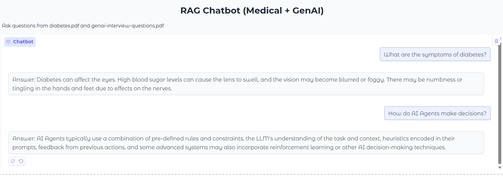

# RAG Chatbot (Medical + GenAI)
A Retrieval-Augmented Generation (RAG) chatbot using LangChain, ChromaDB, and a local LLM (BioMistral) to answer questions from PDF documents.
This project demonstrates end-to-end document question answering using vector search and LLM-based generation.

## Features
- Multi-document support (Medical + GenAI PDFs)
- Semantic search using embeddings
- Vector database (ChromaDB)
- Local LLM inference using LlamaCpp (BioMistral GGUF)
- Hybrid prompt (context + fallback knowledge)
- Interactive chatbot UI using Gradio

## Architecture

```markdown
This pipeline ensures that the LLM generates responses grounded in retrieved document context.

User Query → Retriever → Context → LLM → Answer

## Demo


## Tech Stack
- LangChain
- Sentence Transformers
- ChromaDB
- LlamaCpp (GGUF model)
- Gradio

## How It Works
1. Load PDF documents
2. Split into chunks
3. Generate embeddings
4. Store in vector database
5. Retrieve relevant chunks
6. Pass context + query to LLM
7. Generate concise answer

## Setup

```bash
pip install -r requirements.txt


